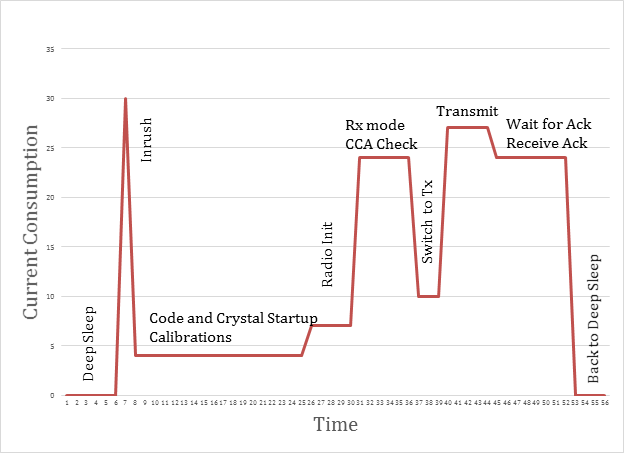
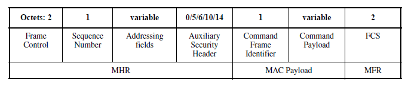
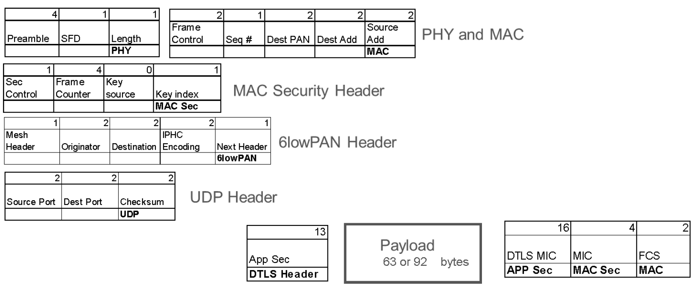

2015年7月13日

Thread 技术白皮书仅供参考。

Thread Group 的成员可以获取完整版本的技术规范说明书。加入 Thread Group 和获取完整版本的技术规范说明书，请参考链接：http://threadgroup.org/Join.aspx 。

如果你已经是 Thread Group 的成员，则可以在 Thread Group 的门户网站获取完整版本的技术规范说明书 http://portal.threadgroup.org 。

如果对该白皮书由任何疑问和建议，请发送邮件至 help@threadgroup.org 。

本文档及其中包含的信息在“不保证”的基础上提供，并且 Thread Group 不提供任何形式的（不论是明示的，还是默示的）保证，包括但不限于（A）保证使用此处的信息不会侵犯任何权利的任何保证。 第三方（包括但不限于任何知识产权，包括专利，版权或商标权）或（B）包括对适销性、适用于特定用途或非侵权性的默认保证。

在任何情况下，Thread Group 不对利润损失、业务损失、数据损失、业务中断、或者任何其它的直接地、间接地、特殊地或惩戒性地、偶发性地、惩罚性、或任何后续性地损害、合同或者侵权行为、与本文相关或者本文包含的信息相关的内容承担赔偿责任，即使被告知有可能被损坏的可能性。

Copyright @ 2015 Thread Group, Inc. All rights reserved.

---
# 电池供电设备

2015年6月

修订历史

|版本|时间|说明|
|---|---|---|
| 1.0|2015年6月13日| 公开发布 |

---
# **目录**
- [简介](#简介)
- [电池供电设备概要](#电池供电设备概要)
- [IEEE802.15.4 终端设备的操作](#ieee802154-终端设备的操作)
- [唤醒睡眠周期的结构](#唤醒睡眠周期的结构)
- [嗜睡设备消息的长度和格式](#嗜睡设备消息的长度和格式)
- [发送消息所需的时间](#发送消息所需的时间)
- [参考](#参考)
---
## 简介
Thread Group 的目标是设计，开发和推广一个开放的智能家居标准，该标准可以为智能家居提供可靠的，低成本的，低功耗的设备到设备之间的无线通讯协议(欲了解更多，请参考"Thread Stack Fundamentals"白皮书。)。该目标的低功耗部分是由电池供电设备来实现的。Thread网络由外部电源供电的Router和电池供电设备组成，Router 作为电池供电设备的父亲节点，它帮助电池供电设备保存接收到消息和路由从电池供电设备发出或者接收的消息。
该白皮书描述了电池供电设备的一些基本操作并比较了它们之间的性能。

##  电池供电设备概要
电池供电设备可以唤醒和轮询其父节点以获取任何消息，也可以唤醒和发送数据。这些操作的效率决定了能量的消耗和最终电池的寿命。优化这些基本的操作对于确保设备的电池寿命至关重要。

## IEEE802.15.4 终端设备的操作
电池供电设备有两个基本的操作：唤醒然后发送数据或者唤醒然后获取发送至自己的数据。因为数据包不能直接发送至电池供电设备，因此电池供电设备的父亲节点会将发送至电池供电设备的数据包保存一段时间，然后电池供电设备会在合适的时间点发送轮询请求给父亲节点请求获取数据包。（图1 展示了两者之间的关系）

图1 Router 作为孩子终端节点的父亲

对于电池供电设备的唤醒和发送操作，它只是简单地唤醒，生成一个包含适当数据的数据包，然后将其发送给它的父亲节点，最后父亲节点负责将该数据包通过 Thread 网络转发到目的地。一个简单的例子：当窗口传感器被激活时，这个中断唤醒处理器发送一条消息，表明窗口现在是打开状态。

IEEE 802.15.4 标准[IEEE802.15.4](https://standards.ieee.org/standard/802_15_4-2006.html)规定了电池供电设备如何向其父亲节点请求数据。具体而言，第5.3.4节详述了数据请求 MAC 命令帧，该帧用于轮询父节点以查看它是否具有数据。如果父亲节点保存有发送至电池供电设备的数据，则父亲节点发送响应确认帧，确认帧的挂起标志位设置为“1”，如果没有发送至电池供电设备的数据，则设置为“0”。这种数据流的一个简单场景是：如果用户想要更改门传感器的配置以更频繁地唤醒和报告状态和电池寿命，此消息首先被发送至嗜睡设备的父节点并保存在那里，以便电池供电设备唤醒并轮询该消息。

## 唤醒睡眠周期的结构
图2举例说明了标准的唤醒睡眠周期。

图2 典型的唤醒睡眠周期

无线电和 MCU (微控制器)按照下面的步骤执行:
1. 从深睡眠中唤醒
2. 完成代码和晶振启动序列
3. 初始化无线电
4. 进入接收模式和检查是否有无线电冲突
5. 切换至发送模式
6. 发送数据包
7. 等待和接收确认帧
8. 返回深睡眠

在该唤醒睡眠周期中，有许多变量会影响实际功耗。一些重要因素：
- 设备从深度睡眠中唤醒并准备好数据帧的时间(实现相关)
- 数据包在空中传输的时间(数据包的长度相关)
- 等待 ACK 包的时间(802.15.4中定义)
- 各种操作期间的有效电流(实现相关)

开发者能够优化一些时间，无线电和 MCU 的设计会影响时间和电流消耗。数据包在空中传输的时间和等待 ACK 包的时间是由数据包的长度和802.15.4中的定义决定的，它们的值不应该随着不同的实现而变化。

## 嗜睡设备消息的长度和格式

有两种数据包格式会影响数据包在空中传输的时间，从而影响睡眠设备的电池寿命：数据轮询 MAC 命令帧和用于发送消息的普通数据帧。

图3举例说明了用于轮询的 IEEE802.25.4 MAC 命令帧格式。

图3 IEEE802.15.4 MAC 命令帧

在 Thread 协议中，地址字段包括2字节 PANID，2字节短目标地址和2字节短源地址。命令的有效载荷为空。 Thread 协议还可以加密数据轮询帧，因此有一个6字节的安全头和一个4字节的 MIC（消息完整性代码）。这意味着数据轮询命令长度为22个字节。

图4 举例说明了一个完整的 Thread 数据包的总体结构。

图4 完整的 Thread 数据包

如果没有使能应用程序的安全性，这些数据包结构将导致35字节的开销。如果将 DTLS（数据报传输层安全性）安全性添加到应用程序（注意这是可选的），这些数据包结构将导致64字节的开销。这些数据包结构决定了数据包的无线电的发送时间。

## 发送消息所需的时间
上面的讨论详述了电池供电设备行为的基本原理。但是，需要进行实际测试以验证无线电和软件实现执行这些操作所需的时间。

表1显示了来自 Thread 电池供电设备的事务处理时间（以毫秒为单位）。

表1 Thread 唤醒睡眠事务处理时间。

|事件|最小时间(毫秒)|最长时间(毫秒)|注意事项|
| :---: | :---: | :---: | :---: |
|数据轮询帧|4.03|6.31| 包长22字节，安全选项打开|
|发送10字节|4.41|8.2||
|发送50字节|8.38|9.94|包长97字节，MAC 安全选项打开|
|发送100字节|12.78|16.78||

所有的帧都打开 MAC 安全选项，包括数据轮询帧。

最小时间和最长时间之间的差异是空闲信道评估时间的变化。

这些操作期间的实际电流消耗取决于所使用的无线电和 MCU 及其有效电流曲线。

例如，在发送数据轮询帧时，使用的能量平均为100微库伦。这意味着每10秒唤醒一次，CR2032 电池的设备将持续约2.6年。

## 参考
|文档|标题|
| --- | --- |
|[IEEE802154]|[Wireless Personal Area Network](https://standards.ieee.org/standard/802_15_4-2006.html)|
