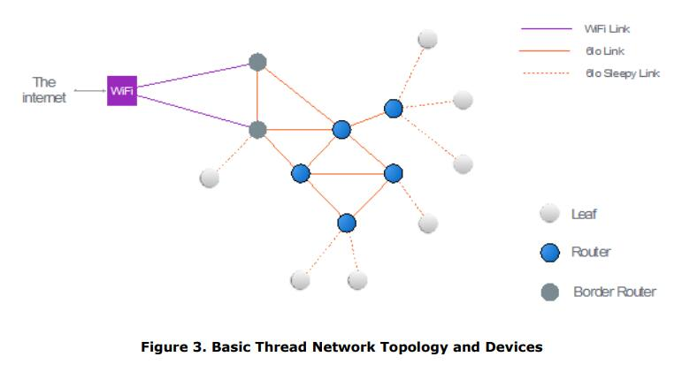
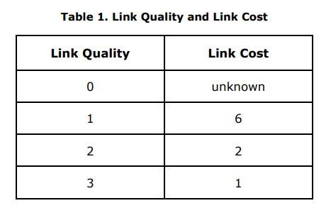
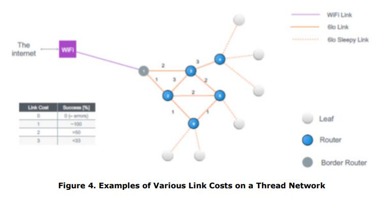
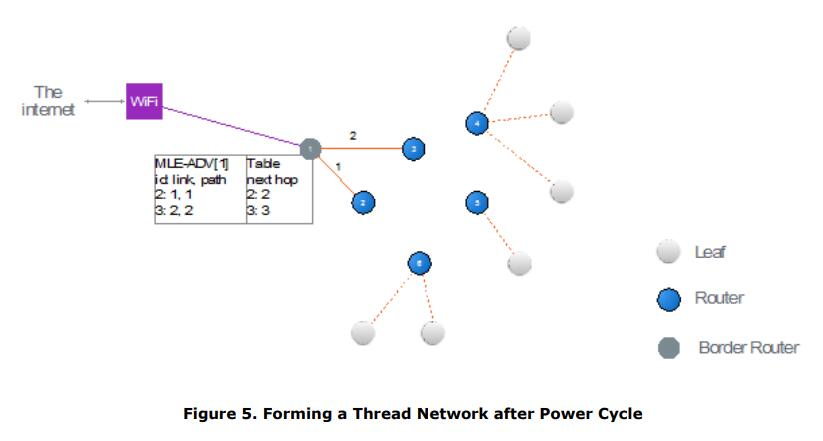
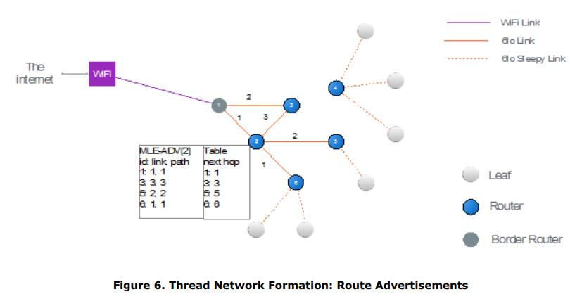
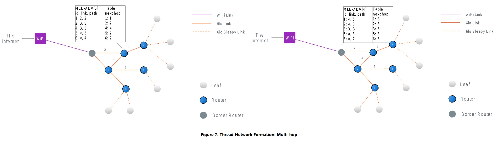
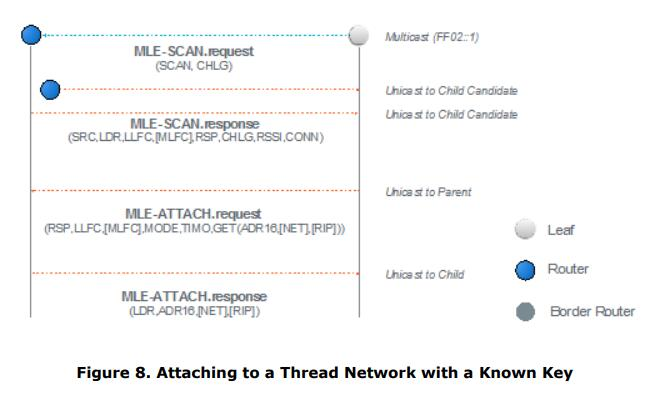

# **Thread Stack Fundamentals** <!-- omit in toc -->

**July 2015**

**修订历史**

| Revision | Date | Comments |
| :-- | :-- | :-- |
| 1.0 | November 29, 2014 | Initial Release |
| 2.0 | July 13, 2015 | Public Release |

July 13, 2015

This Thread Technical white paper is provided for reference purposes only.

The full technical specification is available to Thread Group Members. To join and gain access, please follow this link: [http://threadgroup.org/Join.aspx](http://threadgroup.org/Join.aspx).

If you are already a member, the full specification is available in the Thread Group Portal: [http://portal.threadgroup.org](http://portal.threadgroup.org).

If there are questions or comments on these technical papers, please send them to help@threadgroup.org.

This document and the information contained herein is provided on an “AS IS” basis and THE THREAD GROUP DISCLAIMS ALL WARRANTIES EXPRESS OR IMPLIED, INCLUDING BUT NOT LIMITED TO (A) ANY WARRANTY THAT THE USE OF THE INFORMATION HEREIN WILL NOT INFRINGE ANY RIGHTS OF THIRD PARTIES (INCLUDING WITHOUT LIMITATION ANY INTELLECTUAL PROPERTY RIGHTS INCLUDING PATENT, COPYRIGHT OR TRADEMARK RIGHTS) OR (B) ANY IMPLIED WARRANTIES OF MERCHANTABILITY, FITNESS FOR A PARTICULAR PURPOSE, TITLE OR NONINFRINGEMENT. 

IN NO EVENT WILL THE THREAD GROUP BE LIABLE FOR ANY LOSS OF PROFITS, LOSS OF BUSINESS, LOSS OF USE OF DATA, INTERRUPTION OF BUSINESS, OR FOR ANY OTHER DIRECT, INDIRECT, SPECIAL OR EXEMPLARY, INCIDENTAL, PUNITIVE OR CONSEQUENTIAL DAMAGES OF ANY KIND, IN CONTRACT OR IN TORT, IN CONNECTION WITH THIS DOCUMENT OR THE INFORMATION CONTAINED HEREIN, EVEN IF ADVISED OF THE POSSIBILITY OF SUCH LOSS OR DAMAGE. 

Copyright © 2015 Thread Group, Inc. All rights reserved.

# **目录** <!-- omit in toc -->

- [引言](#引言)
- [设备类型](#设备类型)
- [IP 栈基本原理](#ip-栈基本原理)
- [网络拓扑](#网络拓扑)
- [路由和网络连通](#路由和网络连通)
- [加入一个 Thread 网络](#加入一个-thread-网络)
- [管理](#管理)
- [持久数据](#持久数据)

# 引言

**一般特征**

Thread 栈是一个可靠、经济、低功耗、无线 D2D（device-to-device）通信的开放标准。它是专为哪些需要基于 IP 网络和在栈上使用各种应用层的连接家庭应用程序设计的。

这些是 Thread 栈和网络的一般特征：

* 简单的网络安装，启动和操作：用于形成、加入和维护 Thread 网络的简单协议允许系统在发生路由问题时进行自配置和修复。
* 安全：除非获得授权，并且所有通信都是加密和安全的，否则设备不会加入 Thread 网络。
* 小型和大型网络：家庭网络从几个到几百个设备不等，可以进行无缝通信。网络层旨在基于预期的使用情况来优化网络操作。
* 范围：典型的设备结合 mesh 网络以提供足够的范围来覆盖一个普通的家庭。在物理层采用扩频技术，以提供良好的抗干扰能力。  
* 无单点故障：栈旨在提供安全和可靠的操作，即使个别设备出现故障或丢失。
* 低功耗：主机设备通常可以使用合适的工作周期在 AA 型电池上运行数年。

Figure 1 展示了 Thread 栈的概览。

**IEEE 802.15.4**

本标准基于 IEEE 802.15.4 [\[IEEE802154\]](https://standards.ieee.org/standard/802_15_4-2006.html) PHY（Physical）和 MAC（Media Access Control）层，在 2.4 GHz 频段下以 250kbps 速率工作。Thread 栈使用 IEEE 802.15.4-2006 版本的规范。

802.15.4 MAC 层用于基本的消息处理和拥塞控制。该 MAC 层包括一个为设备监听空闲信道的 CSMA（Carrier Sense Multiple Access）机制，以及一个用于处理相邻设备之间的可靠通信的重试和消息确认的链路层。MAC 层的加密和完整性保护被用于消息上，其基于软件栈较高层的密钥建立和配置。网络层建立在这些底层机制上来提供网络中可靠的端到端通信。

**无单点故障**

在由运行 Thread 栈的设备组成的系统中，这些设备都不表现单点故障。虽然系统中有许多设备执行特殊的功能，但是 Thread 栈的设计使它们可以在不影响 Thread 网络内正在进行的通信的情况下进行替换。例如，一个嗜睡的子系需要一个父系来进行通信，而该父系在通信中表现单点故障。然而，如果其父系不可用，则嗜睡设备 可以/将 选择另一个父系，而此转变对用户不应是可见的。

虽然系统设计成无单点故障，但在某些拓扑结构下，将会有个别设备没有后备能力。例如，在只有单个网关的系统中，如果网关断电，则没有备用网关用以切换。

路由器或边界路由器可以为 Thread 网络中的某些功能承担 Leader 角色。该 Leader 需要在网络内做出决策。例如，Leader 分配路由器地址并允许新的路由器请求。Leader 角色是被选举的，如果 Leader 故障，则由另一个路由器或边界路由器承担 Leader 角色。正是这种自主操作确保了无单点故障。

# 设备类型

**边界路由器**

边界路由器是一种特定类型的路由器，它提供从 802.15.4 网络到其他物理层上的相邻网络（例如，Wi-Fi 和以太网）的连接。边界路由器为 802.15.4 网络内的设备提供服务，包括用于离网操作的路由服务。Thread 网络中可能有一个或多个边界路由器。

> PS：边界路由器 -- Border Routers

**路由器**

路由器为网络设备提供路由服务。路由器还为试图加入网络的设备提供加入和安全服务。路由器并非是为睡眠而设计的（PS：即总是打开接收器）。路由器可以降级其功能并成为 REED（Router-eligible End Devices）。

**适任路由器的终端设备**

REED 具有成为路由器的能力，但由于网络拓扑或条件，这些设备不充当路由器。这些设备通常不会为 Thread 网络中的其它设备转发消息或提供加入或安全服务。如有必要，Thread 网络管理 REED 成为路由器，无需用户交互。

> PS：适任路由器的终端设备 -- Router-eligible End Devices -- REED

**嗜睡终端设备**

嗜睡终端设备是主机设备。它们仅通过其父路由器进行通信，并且无法为其他设备转发消息。

> PS：嗜睡终端设备 -- Sleepy End devices

# IP 栈基本原理

**寻址**

Thread 栈中的设备支持 [\[RFC 4291\]](https://www.ietf.org/rfc/rfc4291) 中指定的 IPv6 寻址架构。设备配置一个或多个 ULA（Unique Local Address）或 GUA（Global Unicast Address）地址。

启动网络的设备选择一个 /64 前缀，然后在整个 Thread 网络中使用。前缀是本地分配的 Global ID，通常称为 ULA 前缀 [\[RFC 4193\]](https://www.ietf.org/rfc/rfc4193)，并且可以称为 mesh 本地 ULA 前缀。Thread 网络还可以具有一个或多个边界路由器，每个边界路由器可以有或没有前缀，以用于生成额外的 GUA。Thread 网络中的设备使用其扩展的 MAC 地址来派生出其接口标识符（如 [\[RFC 4944\]](https://www.ietf.org/rfc/rfc4944) 第 6 部分中所定义的），并从中使用已知的本地前缀 FE80 :: 0/64 配置一个链路本地 IPv6 地址，如 [\[RFC 4862\]](https://www.ietf.org/rfc/rfc4862) 和 [\[RFC 4944\]](https://www.ietf.org/rfc/rfc4944) 所述。

这些设备还支持适当的多播地址。这包括链路本地全节点多播，链路本地全路由多播和领域本地多播。

如 [\[IEEE802154\]](https://standards.ieee.org/standard/802_15_4-2006.html) 中所述，每个加入 Thread 网络的设备都会被分配一个 16-bit 短地址。对于路由器，使用地址字段中的高位分配此地址且低位设置为 0，以表示路由器地址。然后，使用父系的高位和适当的低位为其子系分配一个 16-bit 短地址。这允许 Thread 网络中的任何其他设备简单地通过使用其地址字段的高位来推断其子系的路由位置。

Figure 2 展示了 Thread 的短地址。

**6LoWPAN**

所有设备均使用 [\[RFC 4944\]](https://www.ietf.org/rfc/rfc4944) 和 [\[RFC 6282\]](https://www.ietf.org/rfc/rfc6282) 中定义的 6LoWPAN。

在 Thread 网络内使用报头压缩，并且设备传输消息中尽可能地压缩 IPv6 报头，以最小化传输包的大小。

支持 mesh 报头，以便更有效地压缩 mesh 内的消息，并支持链路层转发，如 [路由和网络连通]() 部分所述。mesh 报头还允许消息的端到端分片，而不是 [\[RFC 4944\]](https://www.ietf.org/rfc/rfc4944) 中指定的逐跳分片。Thread 栈使用 route-over 配置。

设备不支持 [\[RFC 6775\]](https://www.ietf.org/rfc/rfc6775) 中指定的邻居发现，因为 DHCPv6 用于为路由器分配地址。终端设备和 REED 由其父路由器分配短地址。然后，该短地址用于配置 mesh 本地 ULA ，其被用于网络内部通信。

有关 6LoWPAN 使用和配置的更多详细信息，请参见 “**Thread Usage of 6LoWPAN**” 白皮书。Thread 规范的第 3 章详细介绍了使用的特定 6LoWPAN 配置。

**ICMP**

设备支持 ICMPv6（Internet Control Message Protocol version 6）协议 [\[RFC 4443\]](https://www.ietf.org/rfc/rfc4443) 和 ICMPv6 错误消息，以及 echo 请求和 echo 应答消息。

**UDP**

Thread 栈支持 [\[RFC 768\]](https://www.ietf.org/rfc/rfc768) 中定义的 UDP（User Datagram Protocol），以用于设备间的消息传送。

# 网络拓扑

**网络地址和设备**

Thread 栈支持 Thread 网络中所有路由器之间的 full mesh 连通。

实际的拓扑基于 Thread 网络中的路由器数量。如果只有一个路由器或边界路由器，则形成具有单个路由器的基本星型拓扑。如果有多个路由器，则会自动形成 mesh 拓扑。Figure 3 展示了 Thread 网络的基本拓扑和设备类型。

**Mesh 网络**

Mesh 网络允许无线电转发其他无线电的消息，从而使无线电系统更加可靠。例如，如果一个节点不能直接向另一节点发送消息，则 mesh 网络通过一个或多个中间节点转发消息。如 [路由和网络连通]() 部分所述，Thread 网络的本质是所有路由器节点都维护彼此间的路由和连通，因此，mesh 网络将不断地被维护和连接。典型地，Thread 网络中的活跃路由器限制为 32 个。然而，有 64 个路由器地址被使用，以容许路由器地址的回收。

在 mesh 网络中，嗜睡终端设备或 REED 不会为其它设备路由。这些设备将消息发送到父系（作为路由器）。该父系路由器为其子系处理路由操作。

# 路由和网络连通

Thread 网络通常最多有 32 个活跃路由器，其基于设备路由表为消息使用下一跳路由。设备路由表由栈维护，以确保 Thread 网络中的所有路由器都具有任何其他路由器的连通和最新路径。其使用 RIP（Routing Information Protocol）算法（该算法来自 [\[RFC 1058\]](https://www.ietf.org/rfc/rfc1058) 和 [\[RFC 2080\]](https://www.ietf.org/rfc/rfc2080)，但不使用其特定的消息格式）。在 Thread 网络中，所有路由器使用 MLE（Mesh Link Establishment）以压缩格式与其他路由器交换其路由成本。

Note：从 IP 的角度来看，Thread 网络支持路由器和主机。主机要么是嗜睡终端设备，要么是 REED。

**MLE 消息**

MLE 消息（参见 [\[draft-kelsey-intarea-mesh-link-establishment-06\]](https://datatracker.ietf.org/doc/draft-kelsey-intarea-mesh-link-establishment/)，在 Thread 规范的第 4 章消息链路建立中对 Thread 进行了扩展）用于建立和配置安全的无线电链路，检测相邻设备 ，并维护 Thread 网络中设备间的路由成本。MLE 消息通过单跳链路本地单播和路由器间多播来传输。

在拓扑和物理环境发生变化时，MLE 消息用于标识，配置和保护到相邻设备的链路。MLE 还用于分发跨 Thread 网络共享的配置值，如信道和 PAN（Personal Area Network）ID。这些消息可以使用 MPL（Multicast Protocol for Low power and Lossy Networks）指定的简单洪泛（simple flooding）进行转发。（有关详细信息，请参阅 [\[draft-ietf-roll-trickle-mcast-09\]](https://tools.ietf.org/html/draft-ietf-roll-trickle-mcast-09)）

MLE 消息还确保在两个设备间建立路由成本时，非对称链路成本被考虑。非对称链路成本在 802.15.4 网络中很常见。为确保双向消息传递的可靠性，考虑双向链路的成本非常重要。

**路由发现和修复**

按需路由发现通常用于低功耗 802.15.4 网络。然而，按需路由发现在网络开销和带宽方面是昂贵的，因为路由发现请求会泛洪网络。

在 Thread 网络中，所有路由器定期将包含链路成本信息的单跳 MLE 广告包交换到所有邻居路由器，并且将路径成本交换到 Thread 网络中的所有其他路由器。通过这些定期的本地更新，Thread 网络中的所有路由器都有到任何其他路由器的最新路径成本信息，因此不需要按需路由发现。如果路由不再可用，路由器可以选择下一个最合适的路由来到达目的地。这种自愈路由机制允许路由器快速检测其他路由器何时离开 Thread 网络，并计算出最佳路径以维护与 Thread 网络中所有其他设备的连通。

每个方向上的链路质量基于来自相邻设备的传入消息的链路成本。此传入链路成本映射到一个从 0 到 3 的链路质量。值 0 表示未知成本。链路成本是对接收级别以上的接收消息的 RSSI（Received Signal Strength Indicator）的度量。

Table 1 概述了链路质量和链路成本。

Figure 4 展示了 Thread 网络上各种链接成本的示例。

Thread 网络中任何其他节点的路径成本是到达该节点的链路成本的最小总和。即使在网络的无线电链路质量或拓扑发生变化时，路由器也会监控这些成本，并使用定期的 MLE 广告消息通过 Thread 网络传播新成本。路由成本基于两个设备间的双向链路质量。

为了通过一个简单的示例进行说明，可想象出一个具有共享安全材料的 pre-commissioned 网络，其中所有设备同时启动。每个路由器将定期向单跳邻居发送一个广告，其最初仅用成本作为填充。在内部，每个路由器将存储未在广告中发送的下一跳信息。

前几个广告的路径成本等于链路成本，因为已知的唯一路由器是直接邻居，如 Figure 5 所示。

但随后，路由器将开始听到来自邻居的广告，这些广告包含两跳或更多的其他路由器的成本，它们的表使用了多跳路径成本作为填充，然后传播到更远，最终直到网络中所有路由器之间都存在连通信息，如 Figure 6 和 Figure 7 所示。

当路由器从邻居收到一个新的 MLE 广告时，它将已具有该设备的邻居表条目或者将添加一个。MLE 广告包含来自邻居的传入成本，以在路由器的邻居表中更新。MLE 广告还包含其他路由器的更新路由信息，并且该信息将在设备路由表中更新。

通过查看子系地址的高位来确定父路由器地址，从而完成到子设备的路由。一旦设备知道父路由器，它就具有该设备的路径成本信息和下一跳路由信息。

活跃路由器的数量受限于单个 802.15.4 包中可包含的路由和成本信息的数量。目前该限制为 32 个路由器，但提供了 64 个活跃路由器地址，以允许路由器地址老化。

**路由**

设备使用 IP 来路由转发包。设备路由表使用路由器的 mesh 本地 ULA 地址的压缩形式和合适的下一跳进行填充。

距离矢量路由（Distance vector routing）用于获取到 Thread 网络上的路由器地址的路由。在 Thread 网络上进行路由时，该 16-bit 地址的高 6 位定义了目标路由器的路由器地址。如果目标地址的低位为 0，则最终目的地为路由器。否则，目标路由器将负责根据 16-bit 目标地址的低位来转发到最终目标。

对于超出 Thread 网络的路由，边界路由器将通知服务特定前缀的 Leader，并且该信息在 MLE 包内作为 Thread 网络数据被分发。该 Thread 网络数据包括：前缀数据（即前缀本身）、6LoWPAN 上下文，边界路由器和该前缀的 DHCPv6 服务器。如果设备要使用该前缀配置 IPv6 地址，则它将使用 SLAAC（Stateless Address Autoconfiguration）或联系相应的 DHCP（Dynamic Host Configuration Protocol）服务器。Thread 网络数据还包括一个路由服务器列表，其是默认边界路由器的路由器地址。

Leader 被指定，以决定选择 REED 成为路由器或允许路由器降级成为 REED。Leader 还分配和管理路由器地址。然而，此路由 Leader 中包含的所有信息都存在于其他路由器中，如果该路由 Leader 无法到达，则另一个路由器将自动选举并在没有用户干预的情况下接管成为 Leader。

**重试和确认**

虽然在 Thread 栈中使用 UDP 传送，但仍然需要可靠的消息传递。这是使用一系列轻量级机制完成的，如下所示：

* MAC 级重试：每个设备使用来自下一跳的 MAC 确认，并且如果未收到 MAC ACK 消息，则将在 MAC 层重试消息。
* 应用级重试：该应用级可以确定（如果消息可靠性是一个关键参数），并且可以在必要时实现其自己的重试机制。

# 加入一个 Thread 网络

加入设备在参与 Thread 网络之前必须经历各个阶段：

* 发现（Discovery）
* Commissioning
* 附着（Attaching）

所有的加入都是用户在 Thread 网络中发起的。一旦加入，设备将完全参与 Thread 网络，并可与 Thread 网络内外的其他设备和服务交换应用层信息。

**发现**

加入设备必须发现 Thread 网络并与路由器建立联系以进行 commissioning。加入设备扫描所有信道，在每个信道上发出一个信标请求，并等待信标响应。信标（beacon）包含一个有效载荷，该有效载荷包括网络 SSID（Service Set Identifier）和一个许可加入信标（如果 Thread 网络接受该新成员）。一旦设备发现了 Thread 网络，它将使用 MLE 消息确立一个相邻的路由器，通过该路由器可以执行 commissioning。

如果设备已经获得 commissioning 信息，则不需要发现，因为它已经有足够的信息来直接附着到 Thread 网络。

**Commissioning**

Thread 提供两种 commissioning 方法：

* 使用带外（out-of-band）方法将 commissioning 信息直接配置到设备上。commissioning 信息允许加入设备在其被引入网络后立即加入到适当的 Thread 网络。
* 在加入设备和智能手机，平板电脑或 web 上的 commissioning 应用程序之间建立 commissioning 会话。Commissioning 会话安全地将 commissioning 信息传递给加入设备，以允许其在完成 commissioning 会话后附着到适当的 Thread 网络。

Note：典型的仅通过信标有效载荷中的许可加入标志进行加入的 802.15.4 方法不被用于 Thread 网络。此方法最常用于没有用户界面或带外通道的设备的按钮类型加入。在存在多个可用网络的情况下，此方法可能存在设备转向问题，并且可能存在安全问题。

**附着**

带有 commissioning 信息的加入设备与父路由器联系，然后通过交换 MLE 链路配置消息来通过父路由器附着到 Thread 网络。设备将作为终端设备或 REED 附着到 Thread 网络，并由父路由器分配一个 16-bit 短地址，如 Figure 8 所示。

一旦 REED 已附着，它可能会发出一个地址请求以成为路由器，然后由 Leader 分配一个路由器地址。

**MLE 消息**

一旦设备附着到 Thread 网络，它就需要各种信息来维护其在网络中的参与。MLE 提供在整个网络中分发网络数据的服务，并在邻居间交换链路成本和安全帧计数器。

MLE 消息分发或交换以下信息：

* 相邻设备的 16-bit 短地址和 64-bit EUI 64 长地址
* 设备能力信息，包括其是否为嗜睡终端设备以及嗜睡主机设备的睡眠周期
* 邻居链路成本（如果是路由器）
* 设备间的安全材料和帧计数器
* 到 Thread 网络中所有其他路由器的路由成本
* 更新网络数据，例如 MAC 中使用的信道，PAN ID 和信标有效载荷参数

Note：MLE 消息被加密，除了在加入设备获得所需安全材料前的发现期间。

**DHCPv6**

DHCPv6 [\[RFC 3315\]](https://www.ietf.org/rfc/rfc3315) 是一种基于 UDP 的 client-server 协议，用于管理网络中设备的配置。DHCPv6 使用 UDP 从 DHCP 服务器中请求数据。

边界路由器上的 DHCPv6 服务用于配置：

* 网络地址（Network addresses）
* 设备要求的多播地址（Multicast addresses required by devices）
* 主机名服务（Hostname services）

# 管理

**ICMP**

所有设备都支持 ICMPv6 错误消息，以及 echo 请求和 echo 应答消息。

**设备管理**

设备上的应用层可以访问一组设备管理和诊断信息，这些信息可以在本地使用，或收集并发送到其他管理设备。

Thread 从 802.15.4 MAC 层使用的信息包括：

* EUI 64 地址
* 16-bit 短地址
* 能力信息（Capability information）
* PAN ID
* 发送和接收的包（Packets sent and received）
* 发送或接收时丢弃的包（Packets dropped on transmit or receive）
* 安全错误（Security errors）
* MAC 重试次数（Number of MAC retries）

Thread 从网络层使用的信息包括：

* IPv6 地址丢失（IPv6 address lost）
* 邻居表（Neighbor table）
* 子系表（Child table）
* 路由表（Routing table）

# 持久数据

在现场操作的设备可能由于各种原因而被意外或故意重置。已被重置的设备需要重启网络操作（无需用户干预）。为此，需要将一组信息存储在非易失性存储器中。这包括：

* 网络信息（如 PAN ID）
* 安全材料（使用的每个密钥）
* 来自网络的寻址信息以形成设备 IPv6 地址

