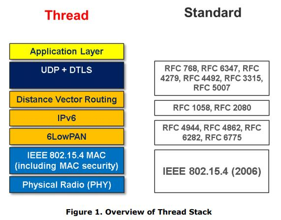
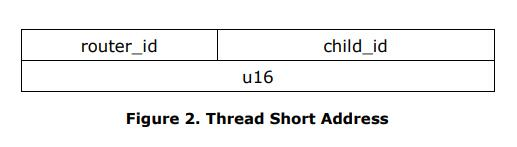

# **Thread Stack Fundamentals** <!-- omit in toc -->

**July 2015**

**修订历史**

| Revision | Date | Comments |
| :-- | :-- | :-- |
| 1.0 | November 29, 2014 | Initial Release |
| 2.0 | July 13, 2015 | Public Release |

July 13, 2015

This Thread Technical white paper is provided for reference purposes only.

The full technical specification is available to Thread Group Members. To join and gain access, please follow this link: [http://threadgroup.org/Join.aspx](http://threadgroup.org/Join.aspx).

If you are already a member, the full specification is available in the Thread Group Portal: [http://portal.threadgroup.org](http://portal.threadgroup.org).

If there are questions or comments on these technical papers, please send them to help@threadgroup.org.

This document and the information contained herein is provided on an “AS IS” basis and THE THREAD GROUP DISCLAIMS ALL WARRANTIES EXPRESS OR IMPLIED, INCLUDING BUT NOT LIMITED TO (A) ANY WARRANTY THAT THE USE OF THE INFORMATION HEREIN WILL NOT INFRINGE ANY RIGHTS OF THIRD PARTIES (INCLUDING WITHOUT LIMITATION ANY INTELLECTUAL PROPERTY RIGHTS INCLUDING PATENT, COPYRIGHT OR TRADEMARK RIGHTS) OR (B) ANY IMPLIED WARRANTIES OF MERCHANTABILITY, FITNESS FOR A PARTICULAR PURPOSE, TITLE OR NONINFRINGEMENT. 

IN NO EVENT WILL THE THREAD GROUP BE LIABLE FOR ANY LOSS OF PROFITS, LOSS OF BUSINESS, LOSS OF USE OF DATA, INTERRUPTION OF BUSINESS, OR FOR ANY OTHER DIRECT, INDIRECT, SPECIAL OR EXEMPLARY, INCIDENTAL, PUNITIVE OR CONSEQUENTIAL DAMAGES OF ANY KIND, IN CONTRACT OR IN TORT, IN CONNECTION WITH THIS DOCUMENT OR THE INFORMATION CONTAINED HEREIN, EVEN IF ADVISED OF THE POSSIBILITY OF SUCH LOSS OR DAMAGE. 

Copyright © 2015 Thread Group, Inc. All rights reserved.

# **目录** <!-- omit in toc -->

- [引言](#引言)
- [设备类型](#设备类型)
- [IP 栈基本原理](#ip-栈基本原理)

# 引言

**一般特征**

Thread 栈是一个可靠、经济、低功耗、无线 D2D（device-to-device）通信的开放标准。它是专为哪些需要基于 IP 网络和在栈上使用各种应用层的连接家庭应用程序设计的。

这些是 Thread 栈和网络的一般特征：
* 简单的网络安装，启动和操作：用于形成、加入和维护 Thread 网络的简单协议允许系统在发生路由问题时进行自配置和修复。
* 安全：除非获得授权，并且所有通信都是加密和安全的，否则设备不会加入 Thread 网络。
* 小型和大型网络：家庭网络从几个到几百个设备不等，可以进行无缝通信。网络层旨在基于预期的使用情况来优化网络操作。
* 范围：典型的设备结合 mesh 网络以提供足够的范围来覆盖一个普通的家庭。在物理层采用扩频技术，以提供良好的抗干扰能力。  
* 无单点故障：栈旨在提供安全和可靠的操作，即使个别设备出现故障或丢失。
* 低功耗：主机设备通常可以使用合适的工作周期在 AA 型电池上运行数年。

Figure 1 展示了 Thread 栈的概览。

**IEEE 802.15.4**

本标准基于 IEEE 802.15.4 \[IEEE802154\] PHY（Physical）和 MAC（Media Access Control）层，在 2.4 GHz 频段下以 250kbps 速率工作。Thread 栈使用 IEEE 802.15.4-2006 版本的规范。

802.15.4 MAC 层用于基本的消息处理和拥塞控制。该 MAC 层包括一个为设备监听空闲信道的 CSMA（Carrier Sense Multiple Access）机制，以及一个用于处理相邻设备之间的可靠通信的重试和消息确认的链路层。MAC 层的加密和完整性保护被用于消息上，其基于软件栈较高层的密钥建立和配置。网络层建立在这些底层机制上来提供网络中可靠的端到端通信。

**无单点故障**

在由运行 Thread 栈的设备组成的系统中，这些设备都不表现单点故障。虽然系统中有许多设备执行特殊的功能，但是 Thread 栈的设计使它们可以在不影响 Thread 网络内正在进行的通信的情况下进行替换。例如，一个嗜睡的子系需要一个父系来进行通信，而该父系在通信中表现单点故障。然而，如果其父系不可用，则嗜睡设备 可以/将 选择另一个父系，而此转变对用户不应是可见的。

虽然系统设计成无单点故障，但在某些拓扑结构下，将会有个别设备没有后备能力。例如，在只有单个网关的系统中，如果网关断电，则没有备用网关用以切换。

路由器或边界路由器可以为 Thread 网络中的某些功能承担 Leader 角色。该 Leader 需要在网络内做出决策。例如，Leader 分配路由器地址并允许新的路由器请求。Leader 角色是被选举的，如果 Leader 故障，则由另一个路由器或边界路由器承担 Leader 角色。正是这种自主操作确保了无单点故障。

# 设备类型

**边界路由器**

边界路由器是一种特定类型的路由器，它提供从 802.15.4 网络到其他物理层上的相邻网络（例如，Wi-Fi 和以太网）的连接。边界路由器为 802.15.4 网络内的设备提供服务，包括用于离网操作的路由服务。Thread 网络中可能有一个或多个边界路由器。

> PS：边界路由器 -- Border Routers

**路由器**

路由器为网络设备提供路由服务。路由器还为试图加入网络的设备提供加入和安全服务。路由器并非是为睡眠而设计的（PS：即总是打开接收器）。路由器可以降级其功能并成为 REED（Router-eligible End Devices）。

**适任路由器的终端设备**

REED 具有成为路由器的能力，但由于网络拓扑或条件，这些设备不充当路由器。这些设备通常不会为 Thread 网络中的其它设备转发消息或提供加入或安全服务。如有必要，Thread 网络管理 REED 成为路由器，无需用户交互。

> PS：适任路由器的终端设备 -- Router-eligible End Devices -- REED

**嗜睡终端设备**

嗜睡终端设备是主机设备。它们仅通过其父路由器进行通信，并且无法为其他设备转发消息。

> PS：嗜睡终端设备 -- Sleepy End devices

# IP 栈基本原理

**寻址**

Thread 栈中的设备支持 \[RFC 4291\] 中指定的 IPv6 寻址架构。设备配置一个或多个 ULA（Unique Local Address）或 GUA（Global Unicast Address）地址。

启动网络的设备选择一个 /64 前缀，然后在整个 Thread 网络中使用。前缀是本地分配的 Global ID，通常称为 ULA 前缀 \[RFC 4193\]，并且可以称为 mesh 本地 ULA 前缀。Thread 网络还可以具有一个或多个边界路由器，每个边界路由器可以有或没有前缀，以用于生成额外的 GUA。Thread 网络中的设备使用其扩展的 MAC 地址来派生出其接口标识符（如 \[RFC 4944\] 第 6 部分中所定义的），并从中使用已知的本地前缀 FE80 :: 0/64 配置一个链路本地 IPv6 地址，如 \[RFC 4862\] 和 \[RFC 4944\] 所述。

这些设备还支持适当的多播地址。这包括链路本地全节点多播，链路本地全路由多播和领域本地多播。

如 \[IEEE802154\] 中所述，每个加入 Thread 网络的设备都会被分配一个 16-bit 短地址。对于路由器，使用地址字段中的高位分配此地址且低位设置为 0，以表示路由器地址。然后，使用父系的高位和适当的低位为其子系分配一个 16-bit 短地址。这允许 Thread 网络中的任何其他设备简单地通过使用其地址字段的高位来推断其子系的路由位置。

Figure 2 展示了 Thread 的短地址。

**6LoWPAN**

所有设备均使用 \[RFC 4944\] 和 \[RFC 6282\] 中定义的 6LoWPAN。

在 Thread 网络内使用报头压缩，并且设备传输消息中尽可能地压缩 IPv6 报头，以最小化传输包的大小。

支持 mesh 报头，以便更有效地压缩 mesh 内的消息，并支持链路层转发，如 [路由和网络连通]() 部分所述。mesh 报头还允许消息的端到端分片，而不是 \[RFC 4944\] 中指定的逐跳分片。Thread 栈使用 route-over 配置。

设备不支持 \[RFC 6775\] 中指定的邻居发现，因为 DHCPv6 用于为路由器分配地址。终端设备和 REED 由其父路由器分配短地址。然后，该短地址用于配置 mesh 本地 ULA ，其被用于网络内部通信。

有关 6LoWPAN 使用和配置的更多详细信息，请参见 “**Thread Usage of 6LoWPAN**” 白皮书。Thread 规范的第 3 章详细介绍了使用的特定 6LoWPAN 配置。

**ICMP**

设备支持 ICMPv6（Internet Control Message Protocol version 6）协议 \[RFC 4443\] 和 ICMPv6 错误消息，以及 echo 请求和 echo 答复消息。

**UDP**

Thread 栈支持 \[RFC 768\] 中定义的 UDP（User Datagram Protocol），以用于设备间的消息传送。

