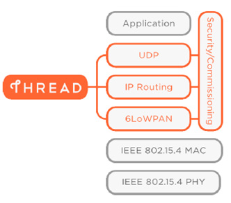
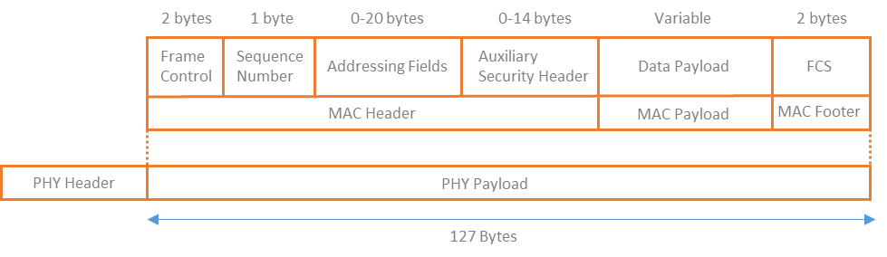
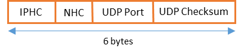
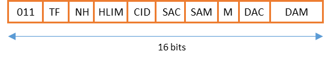
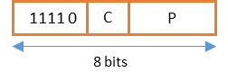
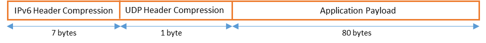
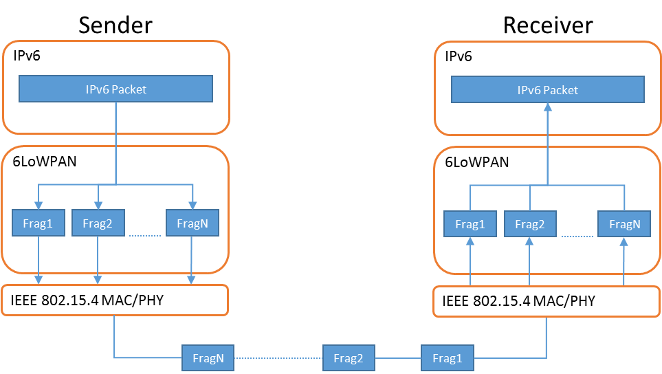
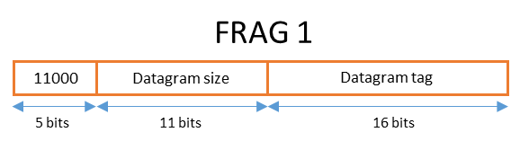
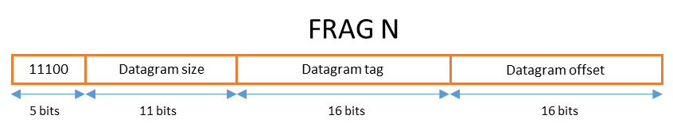
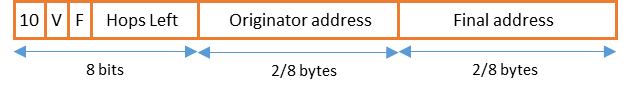

2015年7月13日

Thread 技术白皮书仅供参考。

Thread Group 的成员可以获取完整版本的技术规范说明书。加入Thread Group 和获取完整版本的技术规范说明书，请参考链接：http://threadgroup.org/Join.aspx 。

如果你已经是 Thread Group 的成员，则可以在 Thread Group 的门户网站获取完整版本的技术规范说明书 http://portal.threadgroup.org 。

如果对该白皮书由任何疑问和建议，请发送邮件至 help@threadgroup.org 。

本文档及其中包含的信息在“不保证”的基础上提供，并且 Thread Group 不提供任何形式的（不论是明示的，还是默示的）保证，包括但不限于（A）保证使用此处的信息不会侵犯任何权利的任何保证。 第三方（包括但不限于任何知识产权，包括专利，版权或商标权）或（B）包括对适销性、适用于特定用途或非侵权性的默认保证。

在任何情况下，Thread Group 不对利润损失、业务损失、数据损失、业务中断、或者任何其它的直接地、间接地、特殊地或惩戒性地、偶发性地、惩罚性、或任何后续性地损害、合同或者侵权行为、与本文相关或者本文包含的信息相关的内容承担赔偿责任，即使被告知有可能被损坏的可能性。

Copyright @ 2015 Thread Group, Inc. All rights reserved.

---
# 6LoWPAN 在Thread中的应用

2015年7月

修订历史

|修订|时间|注释|
|--|--|--|
|1.0|2014年11月29日|初始版本|
|2.0|2015年7月13日|发布版本|

---
# **目录**
- [简介](#简介)
- [IEEE802.15.4](#IEEE802.15.4)
- [在802.15.4上传输IPv6](#在802.15.4上传输IPv6)
- [6LoWPAN IPv6包封装](#6LoWPAN-IPv6包封装)
- [6LoWPAN IPv6头压缩](#6LoWPAN-IPv6头压缩)
- [IPv6 头压缩](#IPv6-头压缩)
- [6LoWPAN上下文](#6LoWPAN-上下文)
- [UDP 头压缩](#UDP-头压缩)
- [更多分片细节](#更多分片细节)
- [6LoWPAN Mesh转发](#6LoWPAN-Mesh转发)
- [参考](#参考)

---

## 简介
智能家具设备让我们的生活更加轻松和愉快。连接这些设备并使它们能够进行通信和共享信息对于未来的智能家居至关重要。无线通信技术为这些对象之间的通信链路提供了简洁的解决方案。智能家居中的无线网络需要满足特定要求，例如提供可靠通信的能力，同时消耗非常少的能量。Thread 使用 IEEE 802.15.4 通信标准[[IEEE802154](https://standards.ieee.org/findstds/standard/802.15.4-2006.html)]作为其 RF（射频）连接协议，该标准专为低速率，低功率 WPAN（无线个人区域网络）而设计。为了进一步满足智能家居的连接要求，Thread 采用 IPv6 连接，允许设备彼此通信，访问云中的服务，或通过 Thread 移动应用程序与用户交互。通过开发一个适配层来适配 IPv6 网络层和 802.15.4 链路层，解决了统一 IPv6 和 802.15.4 技术的需求。该层称为 6LoWPAN，如图1所示。

 

图1 Thread 协议栈

使用 IPv6 作为网络层协议要求链路层必须支持1280字节的最小 MTU（最大传输单元）[[RFC2460](https://tools.ietf.org/html/rfc2460)]。考虑到[[IEEE802154](https://standards.ieee.org/findstds/standard/802.15.4-2006.html)]定义的最大 PHY(物理层)包长度为127字节，则需要一个适配层来处理包分片。为了满足这些要求，6LoWPAN 适配层采用了几种不同的技术，例如包分片和报头压缩（用于 IPv6 报头和传输报头，如 UDP（用户数据报协议）），以确保成功发送和接收来自智能家居设备的IPv6数据包。

## IEEE 802.15.4
[[IEEE802154](https://standards.ieee.org/findstds/standard/802.15.4-2006.html)]是一个定义了 PHY 和 MAC（媒体访问控制）层的无线通信的标准，由 IEEE（电气和电子工程师协会）发布。该无线通信协议在设计时考虑到低功耗，它适用于通常涉及大量节点的应用，其中大多数节点可以使用电池供电多年。由低功耗和较低的 BER（误码率）导致的一个特性之一是强制发送较小尺寸的包。在 PHY 层，包长最多可达127个字节。MAC 层有效载荷可以低至88个字节，具体取决于安全选项和寻址类型，如图2所示。

图2 802.15.4 PHY 和 MAC 层载荷

## 在802.15.4上传输IPv6
为了通过 802.15.4 有效地发送 IPv6 数据包，需要解决由低功耗 MAC 和 PHY 协议设计带来的问题：较小的有效载荷和数据包传输的低可靠性。

6LoWPAN 代表“IPv6 低功耗无线个人网络”。它专门用于处理通过 802.15.4 链路发送和接收 IPv6 数据包的限制。在这样做时，它必须保证 802.15.4 的最长帧能够正确发送出去。在以太网链路中，可以通过链路轻松地将大小为 IPv6 MTU（1280字节）的数据包作为一个帧发送。在 802.15.4的情况下，6LoWPAN 充当 IPv6 网络层和 802.15.4 链路层之间的适配层。它通过在发送器处将 IPv6 数据包分片并在接收器处将分片重新组装来解决传输 IPv6 MTU 的问题。6LoWPAN 还提供压缩机制，可减少发送的 IPv6 报头大小，从而减少传输开销。在空中发送的比特越少，设备消耗的能量越少。Thread 充分利用这些机制在 802.15.4 网络上有效地传输数据包。[[RFC4944](https://tools.ietf.org/html/rfc4944)]和[[RFC6282](https://tools.ietf.org/html/rfc6282)]详细描述了完成分片和报头压缩的方法。

6LoWPAN 层的另一个重要特征是能够提供链路层分组转发。它为在网状网络中转发多跳数据包提供了一种非常有效且低开销的机制。Thread 使用 IP 层路由和链路层数据包转发。它利用 6LoWPAN 链路层转发功能来转发数据包，而不必将其发送到网络层。 Thread 充分利用 MAC 层基于短地址（16位长度）提供寻址的能力，以进一步减少通过空中发送以提供有效分组转发所需的信息比特。这样可以在使用基于 IP 的路由协议的同时节省处理周期并同时降低功耗。

通过观察 OSI（开放系统互连）模型，可以注意到 MAC 被认为是第2层，IPv6 网络被认为是第3层。6LoWPAN 作为适配层位于这两者之间，并提供必要的机制和接口让他们互相联系。

总结一下，6LoWPAN 适配层提供如下功能：
* IPv6 包封装
* IPv6 包分片和重组
* IPv6 头压缩
* 链路层转发

后面的章节详细描述了每一项功能。

## 6LoWPAN IPv6包封装
为了实现上述功能，6LoWPAN 层使用封装头来包装 IPv6 数据包，然后使用 802.15.4 MAC 和 PHY 层通过无线方式发送它们。6LoWPAN 数据包的构建原理与 IPv6 数据包相同，并包含每个添加功能的标头。每个 6LoWPAN 标头前面都有一个分配值，用于标识标头的类型，如图3所示。

图3 6LoWPAN 包的一般格式

Thread 使用下面的3种类型的6LoWPAN头：
* Mesh Header (用来在链路层转发数据)
* Fragmentation Header (用来将 IPv6 包分割成多个 6LoWPAN 包)
* Header Compression Header (用来压缩 IPv6 包头)

6LoWPAN 技术规范[[RFC4944](https://tools.ietf.org/html/rfc4944)]中强制规定如果有多个头同时出现，则它们必须按照图4中的定义的顺序放置。

图4 6LoWPAN 包含 IPv6 载荷和压缩的 IPv6 包头

在下面的示例中，6LoWPAN 有效载荷由压缩的 IPv6 报头和除 IPv6 有效载荷的其余部分组成，如图5所示。

图5 6LoWPAN 包包含用于2层转发的 Mesh 头，分片头和一个压缩头

在这些示例中，6LoWPAN 有效负载包含 IPv6 标头和 IPv6 有效负载的一部分。剩余的有效载荷将在后续数据包中传输，这些数据包将具有图6所示的格式。

图6 6LoWPAN 包包含后续的分片，这些分片不包含 IPv6 头中的任何信息

## 6LoWPAN IPv6头压缩
6LoWPAN 使用报头压缩机制来减少通过 802.15.4 链路发送数据时的数据包开销。它通过依赖一组假设（特定于 802.15.4 链路）和链路层中存在的信息，有效地减小了通过空中发送的 IPv6 报头和传输报头的大小。Thread 使用两种类型的压缩，这两种压缩都在[[RFC6282](https://tools.ietf.org/html/rfc6282)]中描述：
* IPHC [改进型头压缩]
* NHC  [下一个头压缩]

IPv6 和 UDP 传输头的压缩字节数取决于多种因素，例如使用的 IPv6 地址类型，802.15.4 寻址模式的类型以及网络上下文是否可用。最佳情况压缩如图7和图8所示（从48字节到6字节）：

图7 完整的 IPv6 和 UDP 头

图8 压缩 IPv6 和 UDP 头后的 6LoWPAN 头

## IPv6 头压缩
IPHC 用于 IPv6 报头压缩，并对[[RFC4944](https://tools.ietf.org/html/rfc4944)]中描述的 HC1 报头压缩方法进行了改进。它为全局 IPv6 地址提供了一种有效的压缩技术，可以减少保留在多跳节点之间的 IP 信息开销。在大多数情况下，它可以利用共享上下文来完全忽略 IP 源和目标地址。考虑到一个 IPv6 地址长度为16个字节的事实，这本身就可以提高压缩效率。

这种压缩方法依赖于通过802.15.4网络中节点之间分发上下文的机制，至于分发上下文的机制是如何实现的，这超出[[RFC4944](https://tools.ietf.org/html/rfc4944)]规定的范围。

IPHC压缩假定在 6LoWPAN 网络内进行通信时，某些 IPv6 报头参数将是常见的，如下所示：
* IPv6 的版本号为6。
* 流量类型和流标签默认为0。
* IP的载荷长度可以由底层的长度计算出来 (6LoWPAN 分片头或者 IEEE 802.15.4头)。
* 跳数限制被源设备设置成一个已知的值。
* 通过共享的上下文信息，地址的前缀在整个网络中是已知的。
* IP 地址的 IID 是由64比特的长地址或者16比特的 IEEE802.15.4 短地址构造的。

在链路本地通信的情况下，可以实现的 IPv6 报头（40字节）的最佳压缩是2字节。但是，当通过多个 IP 节点进行路由时，压缩后的包头最少为7个字节。

IPHC 报头的结构如图9所示，并在表1中进行了解释。

图9 IPHC 编码

表1 IPHC 头字段定义

|字段|定义|
| ---- | --- |
| 011  | 3 bits, 代表IPHC头的分发值。         |
| TF   | 流量类型和流标签。1 bit, 指定流量类型和流标签的压缩方法。|
| NH   | 下一个头。1 bit，标识下一个头是否使用NHC编码。|
| HLIM | 跳数限制。2 bits，标识怎么样压缩跳数限制。|
| CID  | 上下文标识符扩展。1 bit，如果该比特为1，紧接着DAM(目的地址模式)字段，存在一个8比特的CIE（上下文标识符扩展）。|
| SAC  | 源地址压缩。1 bit，标识地址压缩使用无状态地址压缩还是有状态地址压缩。|
| SAM  | 源地址模式。2 bits，和SAC一起决定源地址压缩类型。|
| M    | 多播压缩。1 bit，标识目的地址是否为一个多播地址。|
| DAC  | 目的地址压缩。1 bit，标识地址压缩使用无状态地址压缩还是有状态地址压缩。|
| DAM  | 目的地址模式。2 bits，和DAC一起决定目的地址压缩类型。|

## 6LoWPAN上下文
在 Thread 网络中，IPv6 寻址是任何节点通信的基础。发送到空中的大多数数据包都包含 IPv6 报头。

节点可以分配几种类型的 IPv6 地址，例如链路本地，Mesh Local 和全局地址。

6LoWPAN 层通过利用网络中已知的信息（例如 Mesh Local 和全局前缀）来减小IPv6报头的大小。

Thread 网络中使用的 Mesh Local 和全局前缀由 Leader 管理，Leader 还通过在前缀和上下文之间分配一对一的映射来管理网络上下文，如下所示：

Mesh Local 前缀:

FD00:0DB8::/64 -> Context Id 0 (网络中得第一个非本地链路前缀使用 ID 0)

全局前缀:

2001::/64 -> Context Id 1

2003::/64 -> Context Id 2

在整个 Thread 网络中，所有的节点拥有相同的上下文。使用上下文压缩的第一步是让 Leader 通过传播 Thread 网络数据将上下文分发到 Thread 网络中的所有节点。有关此过程的更多信息，请参见“线程边界路由器”白皮书。分发完成后，设备可以开始发送带有压缩 IPv6 报头的数据包，并在 IPHC 压缩报头中将 CID 字段设置为“1”。这表示在 IPHC DAM 字段之后存在上下文标识符扩展字段。上下文标识符扩展具有图10中所示的结构并在表2中给出了定义。

图10 上下文标识符扩展

表2 上下文标识符扩展定义

|字段|定义|
|---|---|
|SCI|源地址上下文标识符。标识与 IPv6 源地址相关的前缀。|
|DCI|目的地址上下文标识符。标识与 IPv6 目的地址相关的前缀。|

## UDP 头压缩
Thread 中的 UDP 头压缩是通过使用NHC [下一个头压缩]实现的[[RFC4944](https://tools.ietf.org/html/rfc4944)]。NHC 头指定 IPv6 头之后的下一个头的压缩格式。 图11中示出了典型压缩头配置的示例。

图11 头压缩

图12 UDP 头编码

表3  UDP 头编码字段定义

|字段|定义|
| ---    | --- |
| 11110 | 用于压缩 UDP 头的 NHC ID。|
| C      | 校验和。1 bit，标识 UDP 校验和是否包含在数据包中或者被丢弃了。 |
| P      | 端口。2 bits，标识压缩 UDP 端口的方法。|

## 6LoWPAN IPv6包分片
在最坏情况下，IEEE 802.15.4 的 MAC 帧只能携带88个字节的数据。考虑到 IPv6 的MTU为1280字节，是有必要实现分片和重组机制的。从实际的应用程序的角度来看，IEEE 802.15.4 的 MAC 帧能携带的数据的长度太短了。比如，用户使用 UDP 作为传输层，能够提供给应用层的有效的载荷长度为：

MAC Payload (88 bytes) – IPv6 Header (40 bytes) – UDP Header (8) = 40 Bytes

使用[[RFC6282](https://tools.ietf.org/html/rfc6282)]中描述的头压缩技术将增加应用程序有效载荷的可用字节数，但仍然只有80字节，如图13所示。

图13 包含压缩的 IPv6 包头在多跳情况下的应用层载荷

当 IPv6 数据包不能放入单个 IEEE 802.15.4 帧时，6LoWPAN 层会创建封装有原始IPv6数据包的分片，然后再将分片逐个发送出去。6LoWPAN 分片在接收端逐个接收下来，重组成为一个完整的 IPv6 包，最后将 IPv6 包传送到 IP 层，如图14所示。

图14 IPv6包的分片和重组

有一点重要的事情是要考虑所有分片必须到达目的地以便重新组装 IPv6 包。为了避免由于可能的分片丢失而导致内存不足，接收设备应该设置一个定时器，该定时器在接收到对应于 IPv6包 的第一个 6LoWPAN 分片时被激活。如果计时器到期，还有 6LoWPAN 分片未接收到，则设备释放它用于存储该 IPv6 包分片的所有已分配内存。

## 更多分片细节
6LoWPAN 使用两种类型的分片：FRAG1 和 FRAGN。

FRAG1 包含 IPv6 压缩头和一部分有效载荷。FRAGN 数据包是随后发送的后续分片，必须包含 IPv6 有效载荷的剩余部分。FRAG1 和 FRAGN 类型头的格式如图15和图16所示。

图15 第一个分片头

图16 后续分片头

6LoWPAN 分片头中存在的字段用于在接收端重组原始 IPv6 包。表4总结了各个字段定义。

表4 6LoWPAN 分片头字段定义

|分段|定义|
|---|---|
|Datagram Size|原始的 IPv6 包长度|
|Datagram Tag|IPv6 分片包的唯一标识。它通常与设备的源地址一起使用，以建立数据包在网络中的唯一性。它将所有分片连接在一起。|
|Datagram Offset|该字段仅存在于后续片段中，并且包含分片相对于原始数据包的偏移量，以8个字节的倍数表示。在重建原始 IPv6 包时，接收方依靠此字段知道应该将分片复制到何处。

分片的另一个重要特征是分片可能不一定按它们发送的顺序到达。6LoWPAN 可以可靠地重新组装原始数据包，而不管分片到达的顺序如何。唯一必要的条件是接收到所有分片。

## 6LoWPAN Mesh转发
Thread 使用 6LoWPAN 规范中定义的 Mesh 头机制在 Thread 网络中的设备之间转发数据包。6LoWPAN Mesh 头用于每个多跳数据包，如图17所示。

图17 Mesh 头格式

Thread 中的 6LoWPAN 层使用发送方16位短地址和最终目标的16位源地址分别作为 Mesh 头的发送方地址和最终目的地址，在路由表中查找下一跳节点的16位短地址，然后将下一跳节点的16位短地址作为目的地发送6LoWPAN帧。下一跳设备接收数据包，查找路由表/邻居表中的下一跳，减少 6LoWPAN Mesh 头中的跳数，然后将下一跳或最终目的地节点的16位短地址作为目的地发送 6LoWPAN 帧。

## 参考

|参考文档|标题|
| ------------ | --- |
| [IEEE802154] | [Wireless Personal Area Networks](https://standards.ieee.org/standard/802_15_4-2006.html) |
| [RFC 4944]   | [Transmission of IPv6 Packets over IEEE 802.15.4 Networks](https://tools.ietf.org/html/rfc4944) |
| [RFC 6282]   | [Compression Format for IPv6 Datagrams over IEEE 802.15.4-Based Networks](https://tools.ietf.org/html/rfc6282) |
|  N/A         | “Thread Border Routers” white paper |
