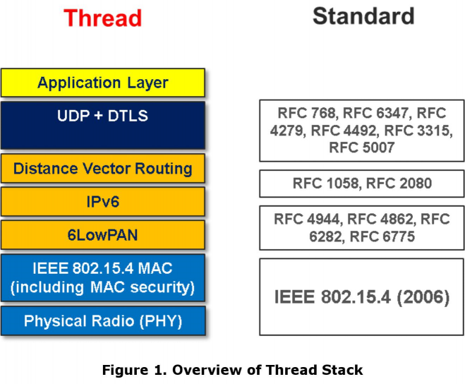
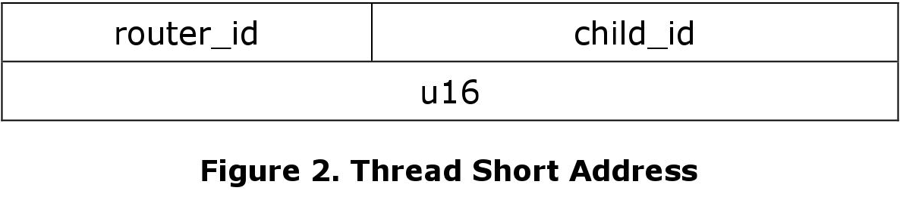
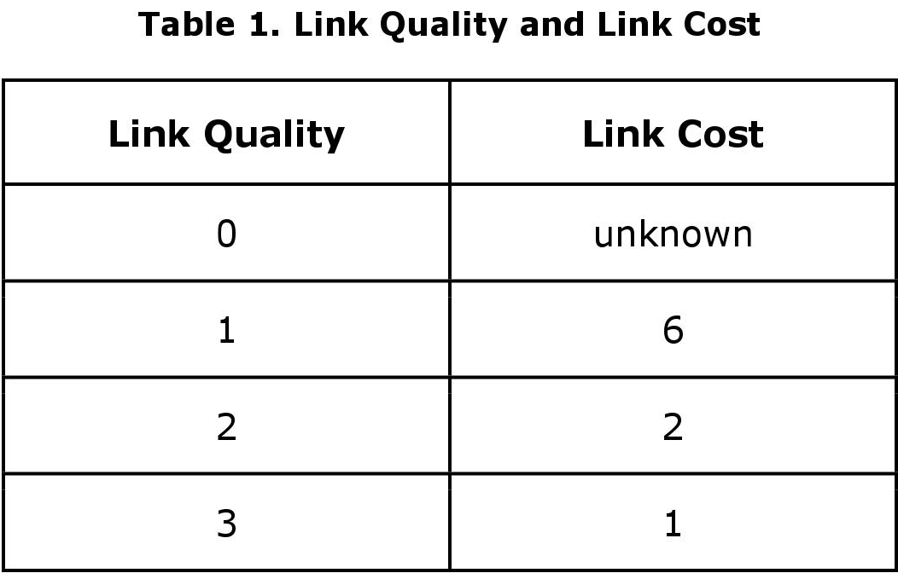
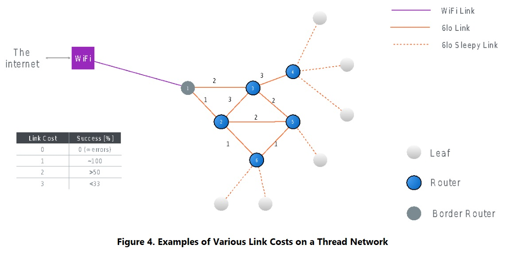
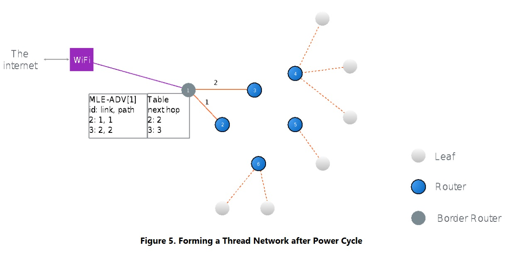
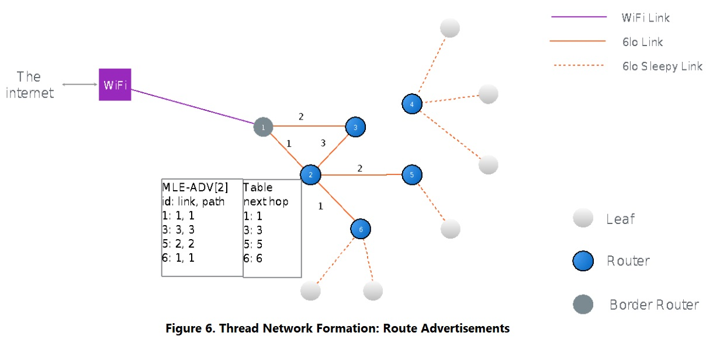

2015 年 7 月 13 日

Thread 技术白皮书仅供参考。

Thread Group 的成员可以获取完整的技术规范。要加入 Thread Group 并获取权限，请访问以下链接：[http://threadgroup.org/Join.aspx](http://threadgroup.org/Join.aspx)。

如果你已经是 Thread Group 的成员，则可以在 Thread Group 的门户网站中获取完整的技术规范：[http://portal.threadgroup.org](http://portal.threadgroup.org)。

如果对该白皮书有任何疑问或建议，请发送邮件至 [help@threadgroup.org](help@threadgroup.org)。

This document and the information contained herein is provided on an “AS IS” basis and THE THREAD GROUP DISCLAIMS ALL WARRANTIES EXPRESS OR IMPLIED, INCLUDING BUT NOT LIMITED TO (A) ANY WARRANTY THAT THE USE OF THE INFORMATION HEREIN WILL NOT INFRINGE ANY RIGHTS OF THIRD PARTIES (INCLUDING WITHOUT LIMITATION ANY INTELLECTUAL PROPERTY RIGHTS INCLUDING PATENT, COPYRIGHT OR TRADEMARK RIGHTS) OR (B) ANY IMPLIED WARRANTIES OF MERCHANTABILITY, FITNESS FOR A PARTICULAR PURPOSE, TITLE OR NONINFRINGEMENT.

IN NO EVENT WILL THE THREAD GROUP BE LIABLE FOR ANY LOSS OF PROFITS, LOSS OF BUSINESS, LOSS OF USE OF DATA, INTERRUPTION OF BUSINESS, OR FOR ANY OTHER DIRECT, INDIRECT, SPECIAL OR EXEMPLARY, INCIDENTAL, PUNITIVE OR CONSEQUENTIAL DAMAGES OF ANY KIND, IN CONTRACT OR IN TORT, IN CONNECTION WITH THIS DOCUMENT OR THE INFORMATION CONTAINED HEREIN, EVEN IF ADVISED OF THE POSSIBILITY OF SUCH LOSS OR DAMAGE. 

Copyright © 2015 Thread Group, Inc. All rights reserved.

---

# Thread 协议栈基础 <!-- omit in toc -->

2015 年 7 月

修订历史

| 版本 | 日期 | 注解 |
| :-- | :-- | :-- |
| 1.0 | 2014 年 11 月 29 日 | 首次发布 |
| 2.0 | 2015 年 7 月 13 日 | 公开发布 |

# 目录 <!-- omit in toc -->

- [引言](#引言)
  - [特征概述](#特征概述)
  - [IEEE 802.15.4](#ieee-802154)
  - [无单点故障](#无单点故障)
- [设备类型](#设备类型)
  - [Border Router](#border-router)
  - [Router](#router)
  - [REED](#reed)
  - [SED](#sed)
- [IP 协议栈基础](#ip-协议栈基础)
  - [寻址](#寻址)
  - [6LoWPAN](#6lowpan)
  - [ICMP](#icmp)
  - [UDP](#udp)
- [网络拓扑](#网络拓扑)
  - [网络地址和设备](#网络地址和设备)
  - [Mesh 网络](#mesh-网络)
- [路由与互联](#路由与互联)
  - [MLE 消息](#mle-消息)
  - [路由发现和修复](#路由发现和修复)
  - [路由](#路由)
  - [重传和确认](#重传和确认)
- [加入 Thread 网络](#加入-thread-网络)
  - [Discovery](#discovery)
  - [Commissioning](#commissioning)
  - [Attaching](#attaching)
  - [MLE 消息](#mle-消息-1)
  - [DHCPv6](#dhcpv6)
- [管理](#管理)
  - [ICMP](#icmp-1)
  - [设备管理](#设备管理)
- [持久化数据](#持久化数据)

# 引言

## 特征概述

Thread 是一个低成本、低功耗、安全可靠的无线设备通信标准。该协议栈是专为基于 IP 网络的互联家居应用设计的，在其之上可以支持各种应用层协议。

Thread 协议栈和网络具有如下特征：

* 易于部署和维护：组建及维护网络的协议简单，允许系统自配置和路由自修复。
* 安全可靠：未经授权的设备无法加入到 Thread 网络，并且网络中的所有通信都是加密保护的。
* 规模可扩展：支持将小型家域网（数个设备）扩展成大型家域网（数百个设备）。网络层会根据预期的使用情况进行优化。
* 覆盖范围可延展：Thread 设备结合 mesh 组网技术，可以提供足以覆盖常规家庭的通信范围。在物理层采用扩频技术，提供良好的抗干扰能力。
* 无单点故障：即使个别设备出现故障或丢失，也不会影响网络的安全性和可靠性。
* 低功耗：如果使用 AA 电池供电，并配以合适的睡眠周期，设备通常可以工作数年。

图 1 展示了 Thread 协议栈的概览。

## IEEE 802.15.4

Thread 基于 [IEEE 802.15.4](https://standards.ieee.org/standard/802_15_4-2006.html) PHY（Physical，物理）和 MAC（Media Access Control，媒体访问控制）层，在 2.4GHz 频段下以 250kbps 速率工作。Thread 使用 IEEE 802.15.4-2006 版本的规范。

802.15.4 的 MAC 层用于基本的消息处理和拥塞控制。该 MAC 层包括一个用于设备监听空闲信道的 CSMA（Carrier Sense Multiple Access，载波侦听多路访问）机制，以及一个用于确保相邻设备间可靠通信（消息重传和确认）的链路层。消息使用 MAC 层的加密和完整性保护机制，所使用的密钥是在网络链路建立和配置中确定的。这些机制确保了网络层能够提供可靠的端到端通信。

## 无单点故障

在 Thread 网络系统中，设备不会表现出单点故障。虽然系统中有许多设备执行特殊的功能，但是 Thread 协议栈的设计使它们可以在不影响 Thread 网络内通信的情况下进行替换。例如，一个子设备需要一个父设备来进行通信。当父设备发生故障时，子设备将会自动选择另一个父设备，该过程无需用户参与。

尽管 Thread 网络的设计目标是无单点故障，但是在实际情况中单点故障的存在与否取决于网络系统的设计。在某些拓扑下，若某个具有特殊功能的设备（如 Gateway）没有备用选项，则该网络系统依然可能会发生单点故障。

Router 或 Border Router 可以在 Thread 网络中担任 Leader 角色。该角色在网络中负责为某些功能作为决策。例如，Leader 需要分配 Router 地址并允许新的 Router 请求。Leader 是选举出来的，如果 Leader 发生故障，则由另一个 Router 或 Border Router 担任 Leader 角色。正是这种自主运作确保了无单点故障。

# 设备类型

## Border Router

Border Router（边界路由器）是一种特殊的 Router，它提供从 802.15.4 网络到其他物理层上的邻近网络（例如，Wi-Fi 和以太网）的连接。Border Router 为 802.15.4 网络内的设备提供服务，包括外网路由服务。单个 Thread 网络中可以有一个或多个 Border Router。

## Router

Router（路由器）为 Thread 网络提供路由服务。Router 还为尝试加入网络的设备提供加入和安全服务。Router 的接收器总是打开的。Router 可以降级其功能并成为 REED。

## REED

REED（Router-eligible End Devices，候选路由节点）具有成为 Router 的能力，但由于网络拓扑或情况，这些设备暂时不充当 Router。这些设备通常不会为 Thread 网络中的其它设备转发消息或提供加入和安全服务。REED 会根据网络情况变化而自主升级成为 Router，该升级过程无需用户干预。

## SED

SED（Sleepy End device，嗜睡终端设备）是主机设备（host device）。它们仅通过它们的父 Router 进行通信，并且无法为其他设备转发消息。

> 说明：“父子节点”用来描述 Router 及与其直接关联的非 Router 设备（如 SED）之间的关系。其中称 Router 为“父节点”，非 Router 设备为 Router 设备的“子节点”。

# IP 协议栈基础

## 寻址

Thread 中的设备支持 [\[RFC 4291\]](https://www.ietf.org/rfc/rfc4291) 中定义的 IPv6 寻址架构。设备将具有一个或多个 ULA（Unique Local Address，唯一本地地址）或 GUA（Global Unicast Address，全局单播地址）。

启动网络的设备选择一个 64 位的 IPv6 前缀，这个前缀会在整个 Thread 网络中使用。该前缀是本地分配的 Global ID，通常称为 ULA 前缀 [\[RFC 4193\]](https://www.ietf.org/rfc/rfc4193)，还可以称为 mesh local ULA 前缀。Thread 网络还可以具有一个或多个 Border Router，每个 Border Router 都可以配置/不配置 IPv6 前缀，该前缀用于为网内节点生成额外的 GUA。Thread 网络中的设备使用其 Extended MAC 地址来派生出其接口标识符（如 [\[RFC 4944\]](https://www.ietf.org/rfc/rfc4944) 第 6 部分中所定义的），并使用公认的本地前缀（FE80::0/64）来生成链路本地 IPv6 地址（如 [\[RFC 4862\]](https://www.ietf.org/rfc/rfc4862) 和 [\[RFC 4944\]](https://www.ietf.org/rfc/rfc4944) 所述）。

Thread 设备也支持多播地址，包括链路本地全节点多播地址（link-local all node multicast），链路本地全路由器多播地址（link-local all-router multicast）以及网络本域多播地址（realm-local multicast）。

每个加入 Thread 网络的设备都会分配到一个 16 位短地址（在 [\[IEEE802154\]](https://standards.ieee.org/standard/802_15_4-2006.html) 中定义）。对于 Router，仅使用地址字段中的高位（低位为 0）来表示 Router 地址。然后，Router 使用其高位和合适的低位为其子节点分配一个 16 位短地址。这样，Thread 网络中的其他设备就可以简单地通过使用其地址字段的高位来推断子节点的路由位置。

图 2 展示了 Thread 的短地址。

## 6LoWPAN

所有设备均使用 [\[RFC 4944\]](https://www.ietf.org/rfc/rfc4944) 和 [\[RFC 6282\]](https://www.ietf.org/rfc/rfc6282) 中定义的 6LoWPAN。

Thread 网络使用报头压缩（header compression），设备在发送消息时会尽可能地压缩 IPv6 报头，以最小化传输包。

Thread 支持 mesh 报头（mesh header)，以有效地压缩 mesh 内的消息和支持链路层的转发（如 [路由与互联](#路由与互联) 部分所述）。Mesh 报头还允许消息的端到端分片（fragmentation），而非 [\[RFC 4944\]](https://www.ietf.org/rfc/rfc4944) 中指定的逐跳分片。Thread 协议栈使用 route-over 配置。

由于使用了 DHCPv6 来为 Router 分配地址，所以 Thread 设备不支持 [\[RFC 6775\]](https://www.ietf.org/rfc/rfc6775) 中指定的邻居发现（neighbor discovery）。End Device 和 REED 由其父 Router 分配短地址，设备将使用这个短地址来生成 mesh local ULA（用于网内通信）。

有关 6LoWPAN 使用和配置的详情，请参见 “**Thread Usage of 6LoWPAN**” 白皮书。Thread 规范的第 3 章详细介绍了特定 6LoWPAN 配置的使用。

## ICMP

Thread 设备支持 ICMPv6（Internet Control Message Protocol version 6，互联网控制消息协议第六版）协议 [\[RFC 4443\]](https://www.ietf.org/rfc/rfc4443) 和 ICMPv6 错误消息，以及 echo 请求和 echo 应答消息。

## UDP

Thread 协议栈支持 [\[RFC 768\]](https://www.ietf.org/rfc/rfc768) 中定义的 UDP（User Datagram Protocol，用户数据报协议），以用于设备间的消息传送。

# 网络拓扑

## 网络地址和设备

Thread 支持网内任意 Router 间的互联。

拓扑的实际情况根据 Thread 网络中的 Router 数量而决定。如果只有一个 Router 或 Border Router，则形成具有单个 Router 的基本星型拓扑。如果有多个 Router，则会自动形成 mesh 拓扑。图 3 展示了 Thread 网络的基本拓扑和设备类型。

## Mesh 网络

在 mesh 网络中，射频节点可以为其它射频节点转发消息，这使得整个系统更加可靠。例如，如果一个节点不能直接向另一节点发送消息，则 mesh 网络通过一个或多个中间节点转发消息。如 [路由与互联](#路由与互联) 部分所述，Thread 网络的本质是所有 Router 节点都会维护彼此间的路由与互联，进而维护了 mesh 网络的连通性。一般情况下，Thread 网络中的活跃 Router 限制为 32 个，但是网络支持 64 个 Router 地址来保证冗余。

在 mesh 网络中，SED 或 REED 不会为其它设备路由。这些设备将消息发送到其父 Router。父 Router 会为其子节点处理路由操作。

# 路由与互联

Thread 网络通常最多有 32 个活跃 Router，可以在进行消息转发时基于设备路由表提供下一跳路由。Thread 协议栈维护设备路由表，确保所有 Router 的连通性以及 Router 间最新的路由信息。设备路由表使用 RIP（Routing Information Protocol，路由信息协议）算法（该算法来自 [\[RFC 1058\]](https://www.ietf.org/rfc/rfc1058) 和 [\[RFC 2080\]](https://www.ietf.org/rfc/rfc2080)，但不使用其特定的消息格式）。在 Thread 网络中，到其它 Router 的路由成本信息被压缩后通过 MLE（Mesh Link Establishment，Mesh 链路建立）实现 Router 之间的路由信息交换。

> 注：从 IP 的角度来看，Thread 网络支持 Router 和主机。主机包括 SED 和 REED。

## MLE 消息

MLE 消息（参见 [\[draft-kelsey-intarea-mesh-link-establishment-06\]](https://datatracker.ietf.org/doc/draft-kelsey-intarea-mesh-link-establishment/)，Thread 规范第 4 章 Mesh 链路建立（Mesh Link Establishment）对其进行了扩展）用于建立和配置安全的无线链路、检测相邻设备、以及维护 Thread 网络中设备间的路由成本。MLE 消息通过单跳的链路本地单播或多播进行传输。

在拓扑和物理环境发生变化时，MLE 消息可用于标识、配置和保护到相邻设备的链路。MLE 也可用于分发 Thread 网络共享的网络配置信息，如信道和 PAN（Personal Area Network，个域网）ID。这些消息可以使用 MPL（Multicast Protocol for Low power and Lossy Networks，用于低功耗和有损网络的多播协议）指定的简单泛洪（simple flooding）进行转发。（有关详情，请参阅 [\[draft-ietf-roll-trickle-mcast-09\]](https://tools.ietf.org/html/draft-ietf-roll-trickle-mcast-09)）。

在计算设备间的路由成本时，MLE 消息还充分考虑了在 802.15.4 无线网络中普遍存在的非对称链路问题。为确保双向消息传递的可靠性，考虑双向链路的成本非常重要。

## 路由发现和修复

低功耗 802.15.4 网络通常使用请求式（On-demand）路由发现。然而，这种路由发现消息会在网络中进行泛洪广播，从而造成巨大的网络资源和带宽消耗。

在 Thread 网络中，所有 Router 周期性地交换单跳的 MLE 广播包，这些广播包中含有发送节点到邻居 Router 的链路质量信息以及到网络中所有其它 Router 的路由成本信息。通过这些定期的本地更新，Thread 网络中的所有 Router 都将具有到其他 Router 的最新路由成本信息，因此无需请求式路由发现。如果到目的地的某条路径不再可用，Router 会选择另外一条最合适的路径。Router 采用这种自愈式路由机制，可以快速检测到某些 Router 的离开、重新计算到网内其它 Router 的最佳路径、维护网络的连通性。

每个方向的链路质量根据所接收消息（来自相邻设备）的链路成本得出。所接收的链路成本将反映其链路质量（使用 \[0, 3\] 区间的值来指示，0 表示未知成本）。链路成本是对所接收消息的 RSSI（Received Signal Strength Indicator，接收信号强度指标）超出接收灵敏度部分的量度。

表 1 总结了链路质量和链路成本。

图 4 展示了 Thread 网络上各种链路成本的示例。

Thread 网络中某节点到其它任意节点的路由成本是到后者的链路成本的最小总和。Router 会持续监测这些路由成本。在无线链路质量或者网络拓扑发生变化时，Router 会通过周期性的 MLE 广播消息将新的路由成本传播到 Thread 网络内。路由成本根据相邻设备间的双向链路质量得出。

接下来通过一个简单的示例进行说明。假设有一个已经通过安全认证的网络，该网络里所有的设备拥有相同的安全凭证，并且是同时上电启动的。最初，每个 Router 发送的 MLE 广播中仅包含到其单跳邻居的路由成本信息。Router 本地会存储下一跳信息，这些信息并不会体现在 MLE 广播包中。

开始时 Router 仅知道其直接邻居 Router 的链路信息，所以对于开始的几条 MLE 广播消息，路由成本通常等于链路成本，如图 5 所示。

随后，Router 将会听到来自邻居 Router 的广播，进而可以计算到其邻近两跳或者多跳的路由成本，计算所得的包含多跳路由成本信息的路由表会继续广播出去，最终得到网络内所有 Router 间的互联信息，如图 6 和图 7 所示。

当 Router 收到来自邻居的新的广播包时，其本地可能已经存在一条关于该邻居的路由表记录，如果没有，则会新增一条邻居路由表记录。该条邻居路由表中的信息会根据 MLE 广播中包含的来路质量进行更新。同时 MLE 广播包中还包含了其邻居到其它 Router 的路由信息，该 Router 会据此更新本地的路由表。

到子节点的路由是通过查看其短地址的高位确定其父 Router 短地址实现的。一旦知道其父 Router，就可以知道路由成本以及下一跳路由信息了。

活跃 Router 的数量受限于单个 802.15.4 包中可包含的路由和成本信息的数量。在目前的 Thread 网络中，虽然活跃 Router 的数量限制为 32 个，但是却提供了 64 个活跃 Router 地址。这使得在部分 Router 地址过时并尚未回归到地址池之前仍有足够的 Router 地址可用。

## 路由

设备使用 IP 来路由转发包。设备路由表使用 Router 的 mesh local ULA 地址的压缩形式和合适的下一跳进行填充。

距离矢量路由（Distance vector routing）用于获取到 Thread 网络上的 Router 地址的路由。在 Thread 网络上进行路由时，该 16 位地址的高 6 位定义了目标 Router 的 Router 地址。如果目标地址的低位为 0，则最终目的地为 Router。否则，目标 Router 将负责根据 16 位目标地址的低位来转发到最终目标。

Border Router 可以为特定的前缀提供网外路由服务。Border Router 会将这些信息通知 Leader，Leader 最终会将该信息通过 MLE 消息中的 Thread Network Data 分发给全网。Thread Network Data 包括：前缀数据（即前缀本身）、6LoWPAN 上下文、Border Router 和该前缀的 DHCPv6 服务器。如果设备要使用该前缀配置 IPv6 地址，则它将使用 SLAAC（Stateless Address Autoconfiguration，无状态地址自动配置）或联系相应的 DHCP（Dynamic Host Configuration Protocol，动态主机配置协议）服务器。Thread Network Data 还包括一个路由服务器列表，其是默认 Border Router 的 Router 地址。

Leader 需要决定 REED 的升级或 Router 的降级。Leader 还负责分配和管理 Router 地址。然而，此 Leader 中包含的所有信息都存在于其他 Router 中，如果该 Leader 发生故障，那么在没有用户干预的情况下，另一个 Router 可以自主进行选择，从而接管 Leader 的角色。

## 重传和确认

虽然在 Thread 协议栈中使用 UDP，但仍然需要可靠的消息交付。可靠的消息交付通过如下一系列轻量级机制完成：

* MAC 级重传：每个设备使用来自下一跳的 MAC 确认，并且如果没有收到 MAC 层消息确认，将会重试 MAC 层重传。
* 应用级重传：应用层根据消息可靠交付的重要性进行决定，在需要时可以实现应用层重传。

# 加入 Thread 网络

待加入设备必须经历如下阶段才能加入到 Thread 网络中：

* Discovery（发现）
* Commissioning
* Attaching（加入）

在 Thread 网络中，所有的加入操作都是用户发起的。一旦成功加入，设备将完全参与 Thread 网络，并可与 Thread 网络内外的其他设备和服务交换应用层信息。

## Discovery

待加入设备必须 Discovery Thread 网络并与 Router 建立联系以进行 commissioning。待加入设备扫描所有信道，在每个信道上发出一个信标请求，并等待信标响应。信标（beacon）包含一个有效载荷，该有效载荷包括网络 SSID（Service Set Identifier，服务集标识符）和一个许可加入信标（如果 Thread 网络接受该新成员）。一旦设备 Discovery 了 Thread 网络，它将使用 MLE 消息确立一个相邻的 Router，然后通过该 Router 可以执行 commissioning。

如果设备已经获得 commissioning 信息，则无需 Discovery，因为它已经有足够的信息来直接 Attaching 到 Thread 网络。

## Commissioning

Thread 提供两种 commissioning 方法：

* 使用带外（out-of-band）方法将 commissioning 信息直接配置到设备上。commissioning 信息允许待加入设备在其被引入网络后立即 Attaching 到合适的 Thread 网络。
* 在待加入设备和智能手机、平板电脑或网站上的 commissioning 应用之间建立 commissioning 会话。Commissioning 会话安全地将 commissioning 信息传递给待加入设备，以允许其在完成 commissioning 会话后 Attaching 到合适的 Thread 网络。

> 注：802.15.4 中使用的仅通过信标中的许可加入标志位来进行加入的方式并不适用于 Thread 网络。此方法最常用于没有用户界面或带外通道的设备的按钮类型加入。在存在多个可用网络的情况下，此方法可能存在设备转向问题，并且可能存在安全问题。

## Attaching

带有 commissioning 信息的待加入设备与父 Router 联系，然后通过交换 MLE 链路配置消息来通过父 Router 加入到 Thread 网络。在此阶段，设备将以 End Device 或 REED 的角色 Attaching 到 Thread 网络中，并得到由其父 Router 分配的一个 16 位短地址，如图 8 所示。

在加入到网络后，若设备的角色为 REED，则它可能会向 Leader 发送一条地址请求消息，以尝试升级成 Router。如果成功，Leader 将会为其分配一个 Router 地址。

## MLE 消息

一旦设备加入到 Thread 网络，它就需要各种信息来维护其在网络中的参与。MLE 提供在整个网络中分发网络数据的服务，并在邻居间交换链路成本和安全帧计数器。

MLE 消息分发或交换以下信息：

* 相邻设备的 16 位短地址和 64 位 Extended MAC 长地址
* 设备能力信息，包括其是否为 SED 以及 SED 的睡眠周期
* 邻居链路成本（如果是 Router）
* 设备间的安全凭证和帧计数器
* 到 Thread 网络中所有其他 Router 的路由成本
* 更新的网络数据，例如 MAC 中使用的信道、PAN ID 和信标有效载荷参数

> 注：除了待加入设备获得所需安全凭证前的 Discovery 期间，MLE 消息都是加密的。

## DHCPv6

DHCPv6 [\[RFC 3315\]](https://www.ietf.org/rfc/rfc3315) 是一种基于 UDP 的 client-server 协议，用于管理网络中设备的配置。DHCPv6 使用 UDP 从 DHCP 服务器中请求数据。

Border Router 上的 DHCPv6 服务用于配置：

* 网络地址（Network addresses）
* 设备要求的多播地址（Multicast addresses required by devices）
* 主机名服务（Hostname services）

# 管理

## ICMP

所有设备都支持 ICMPv6 错误消息，以及 echo 请求和 echo 应答消息。

## 设备管理

设备上的应用层可以访问一组设备管理和诊断信息，这些信息可以在本地使用，或收集并发送到其他管理设备。

Thread 在 802.15.4 MAC 层上使用的信息包括：

* Extended MAC 地址
* 16 位短地址
* 能力信息（Capability information）
* PAN ID
* 发送/接收的包统计（Packets sent and received）
* 发送/接收时丢弃的包统计（Packets dropped on transmit or receive）
* 安全错误（Security errors）
* MAC 重传次数（Number of MAC retries）

Thread 在网络层上使用的信息包括：

* IPv6 地址列表（IPv6 address list）
* 邻居表（Neighbor table）
* 子系表（Child table）
* 路由表（Routing table）

# 持久化数据

在现场操作的设备可能由于各种原因而被意外或故意重置。已被重置的设备需要重启网络操作（无需用户干预）。为此，需要将一组信息存储在非易失性存储器中。这包括：

* 网络信息（如 PAN ID）
* 安全凭证（使用的每个密钥）
* 用以形成设备 IPv6 地址的信息
